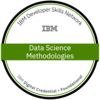
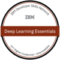
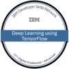
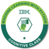

## Hi there 👋

I am **Mugunthan R!**

Ambitious Engineer with good skills in Data Structure and Algorithm. Highly effective working in fast-paced environments. Also has a piece of good knowledge of Deep Learning and automation processes.

## 🌱 I’m currently learning 
- Data Handling
- Machine Learning
- DeepLearning

## 👯 I’m looking to collaborate on
- AI/ML Projects

## 💻 Programming Knowledge

- Python3
- Java
- C++
- MATLAB

## 🥇 My professional Badges

### Google Cloud:

### IBM:

#### My GitHub Stats

*Constantly working on improving these counts*

## 📫 Reach me out @

[.svg)](mailto:mugunthanramesh6@gmail.com)

<!--
**mugunthanramesh/mugunthanramesh** is a ✨ _special_ ✨ repository because its `README.md` (this file) appears on your GitHub profile.

Here are some ideas to get you started:

- 🔭 I’m currently working on ...
- 🌱 I’m currently learning ...
- 👯 I’m looking to collaborate on ...
- 🤔 I’m looking for help with ...
- 💬 Ask me about ...
- 
- 😄 Pronouns: ...
- ⚡ Fun fact: ...
-->
